# Test specification for String Works Editor

All tests requires access to https://stringworkseditor.netlify.app/ and that the application is loaded.

## Testcases

| ID    | Description                                                          |
| ----- | -------------------------------------------------------------------- |
| TC1   | Type text in text area.                                              |
|  TC2  | Paste text in text area.                                             |
|  TC3  | Shortest word is presented.                                          |
|  TC4  | Longest word is presented.                                           |
|  TC5  |  Most frequent letter is presented.                                  |
|  TC6  |  Most frequent letter (case-sensitive) is presented.                 |
|  TC7  | Total number of words is presented.                                  |
|  TC8  | Total number of letters is presented.                                |
|  TC9  | Test of the phrase count feature.                                    |
|  TC10 |  Sorted words are presented (ascending order, default).              |
|  TC11 | Change sort order to descending.                                     |
|  TC12 |  Duplicate words are presented in "Sorted words".                    |
| TC13  |  Statistics and sorted words are resetted when text area is emptied. |

## TC1:

Test connected to requirement R1: _It should be possible to type text and paste text in a textarea._

**Pre-requisites**  
The user is on the website of the application and it has loaded correctly. The caret for typing in the textarea are visible and blinking. The textarea is empty.

**Test steps:**  

1. User types on the keyboard and writes the sentence: _Last Christmas I gave you my heart_

**Expected output:**  

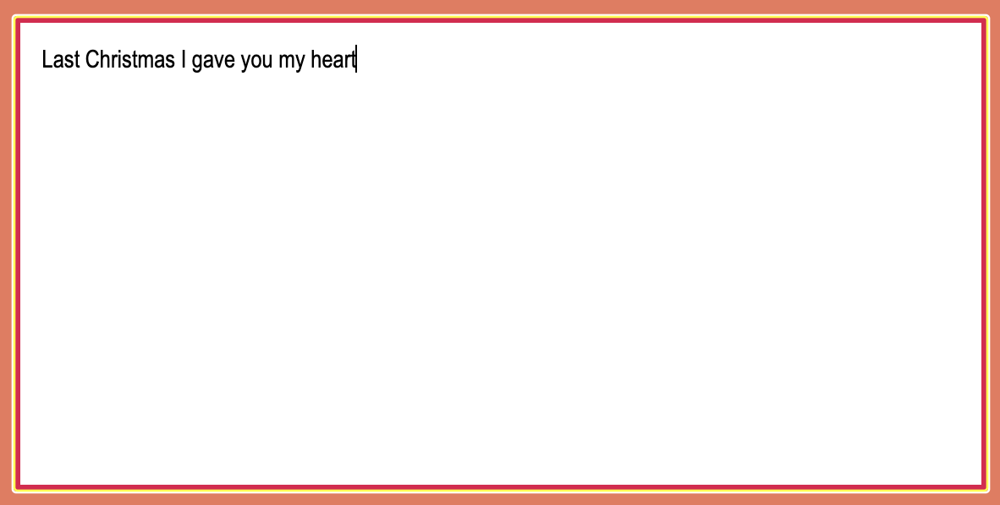

## TC2:

Test connected to requirement R1: _It should be possible to type text and paste text in a textarea._

**Pre-requisites**  
Same as testcase 1.

**Test steps:**  

1. User marks the informational text about String Works Editor to the left of the page
2. User copies the text
3. User pastes the text in the textarea

**Expected output:**  

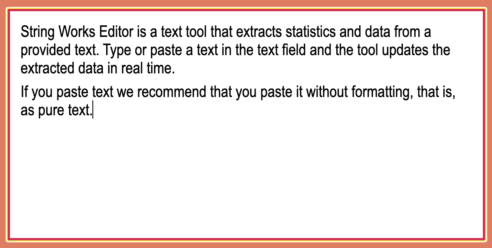

## TC3:

Test connected to requirement R2: _The shortest word in the text is shown in a table along with the number of letters in that word._

**Pre-requisites**  
The text that was pasted to the textarea in testcase 2 are still there.

**Expected output:**  
In the area called "Words and Letters", under "Word lengths", the following should be displayed:  

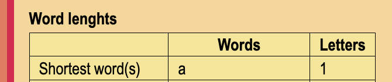

## TC4:

Test connected to requirement R3: _The longest word in the text is shown in a table along with the number of letters in that word._

**Pre-requisites**  
The text that was pasted to the textarea in testcase 2 are still there.

**Expected output:**  
In the area called "Words and Letters", under "Word lengths", the following should be displayed:  

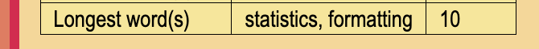

## TC5:

Test connected to requirement R4: _The most frequently used letter in the text is shown in a table along with the number of occurrences of that letter._

**Pre-requisites**  
The text that was pasted to the textarea in testcase 2 are still there.

**Expected output:**  
In the area called "Words and Letters", under "Letter occurrences", the following should be displayed:  

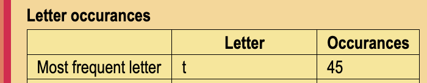

## TC6:

Test connected to requirement R5: _The most frequently used letter (CASE SENSITIVE) in the text is shown in a table along with the number of occurrences of that letter._

**Pre-requisites**  
The text that was pasted to the textarea in testcase 2 are still there.

**Expected output:**  
In the area called "Words and Letters", under "Letter occurrences", the following should be displayed:  

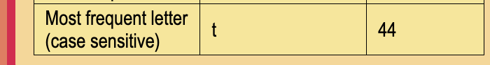

## TC7:

Test connected to requirement R6: _The total number of words in the text should be presented._

**Pre-requisites**  
The text that was pasted to the textarea in testcase 2 are still there.

**Expected output:**  
In the area called "Words and Letters", by "Word count", the following should be displayed:  

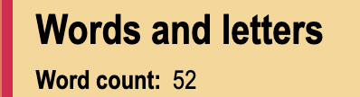

## TC8:

Test connected to requirement R7: _The total number of letters in the text should be presented._

**Pre-requisites**  
The text that was pasted to the textarea in testcase 2 are still there.

**Expected output:**  
In the area called "Words and Letters", by "Letter count, total", the following should be displayed:  

## TC9:

Test connected to requirement R8: _It should be possible to pass a phrase (word or single letter) and get the number of occurrences of that phrase._

**Pre-requisites**  
The text that was pasted to the textarea in testcase 2 are still there.

**Test steps:**  

1. In the input field of the area called "Count specified phrase" the user types the word _text_ and presses Enter.

**Expected output:**  

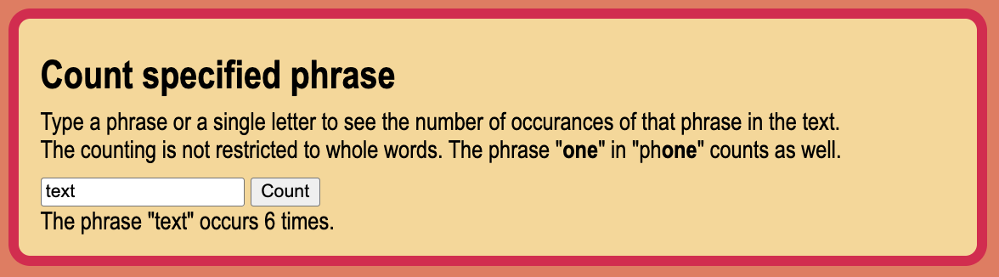

## TC10:

Test connected to requirement R9: _It should be possible to sort the words in the text in alphabetically order (ascending or descending)._

**Pre-requisites**  
The text that was pasted to the textarea in testcase 2 are still there.

**Expected output:**  

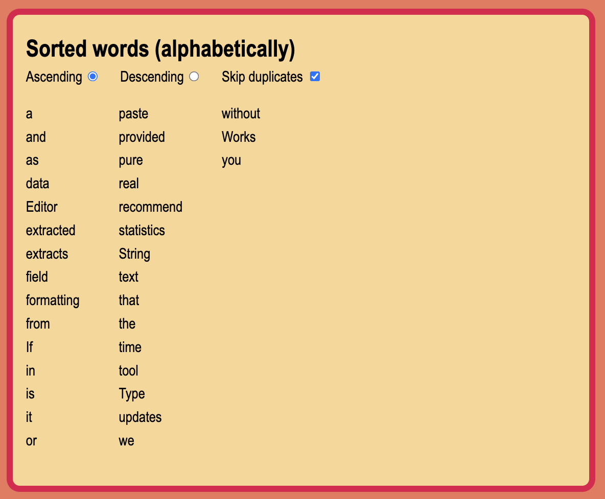

## TC11:

Test connected to requirement R9: _It should be possible to sort the words in the text in alphabetically order (ascending or descending)._

**Pre-requisites**  
The text that was pasted to the textarea in testcase 2 are still there. The radio button "Ascending" in "Sorted words" area is checked.

**Test steps:**  

1. The user clicks on the "Descending" radio button in "Sorted words" area.

**Expected output:**  
The words should now be sorted in descending alphabetically order.  
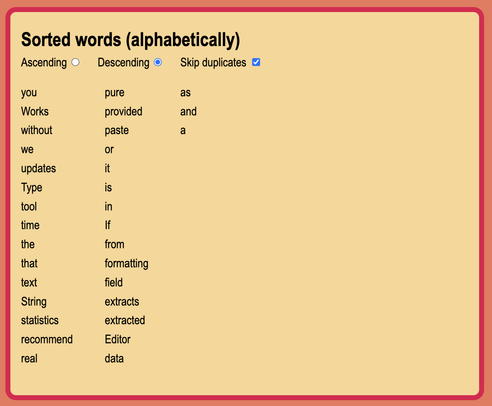

## TC12:

Test connected to requirement R9: _It should be possible to sort the words in the text in alphabetically order (ascending or descending)._

**Pre-requisites**  
Everything should be as it was after testcase 11 was executed (words should be sorted in descending order).

**Test steps:**  

1. The user clicks on the "Skip duplicates" checkbox in "Sorted words" area.

**Expected output:**  
The words should now be sorted in descending alphabetically order but with duplicate words present.  

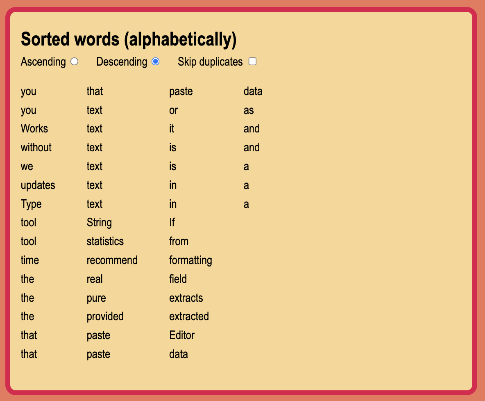

## TC13:

Test connected to requirement R10: _When all text in the text area is removed all statistics counters should be resetted._

**Pre-requisites**  
There is some text present in the text area.

**Test steps:**  

1. The user deletes all text in the text area.

**Expected output:**  
All statistics should be resetted and all sorted words should be gone.  

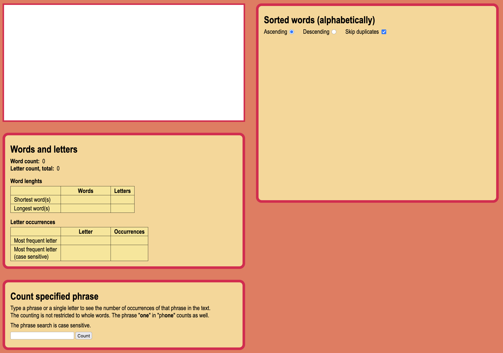
